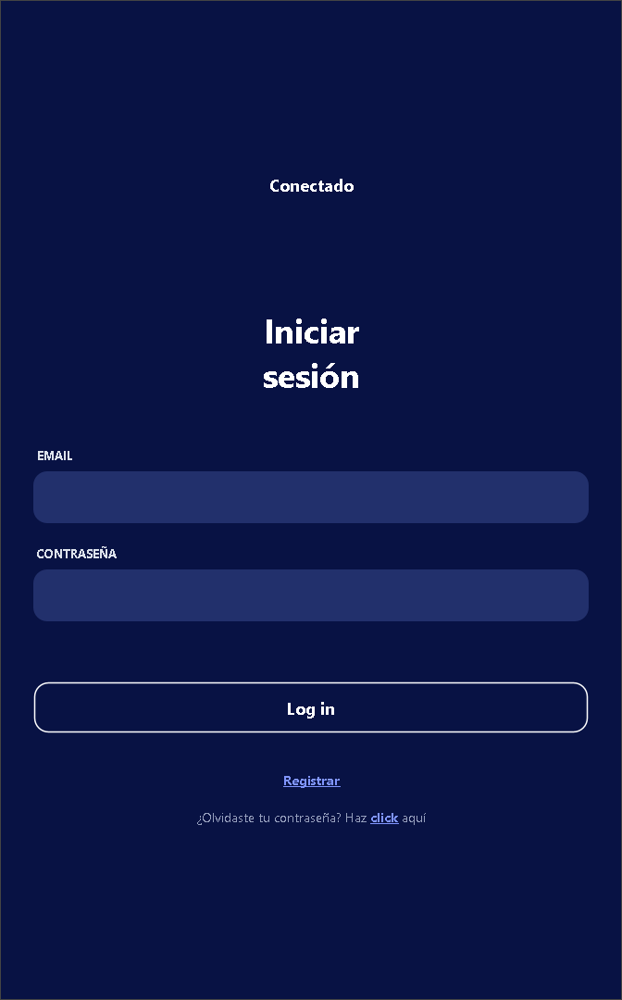
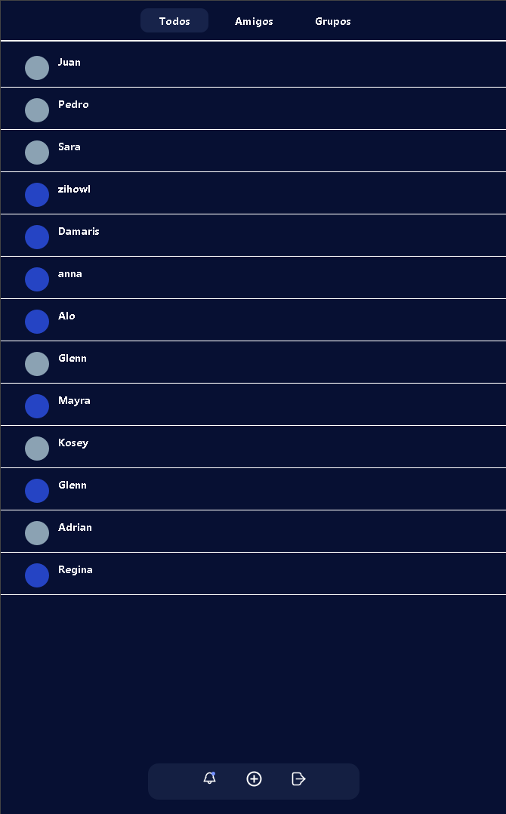
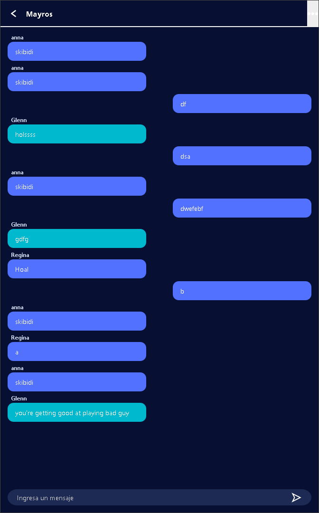
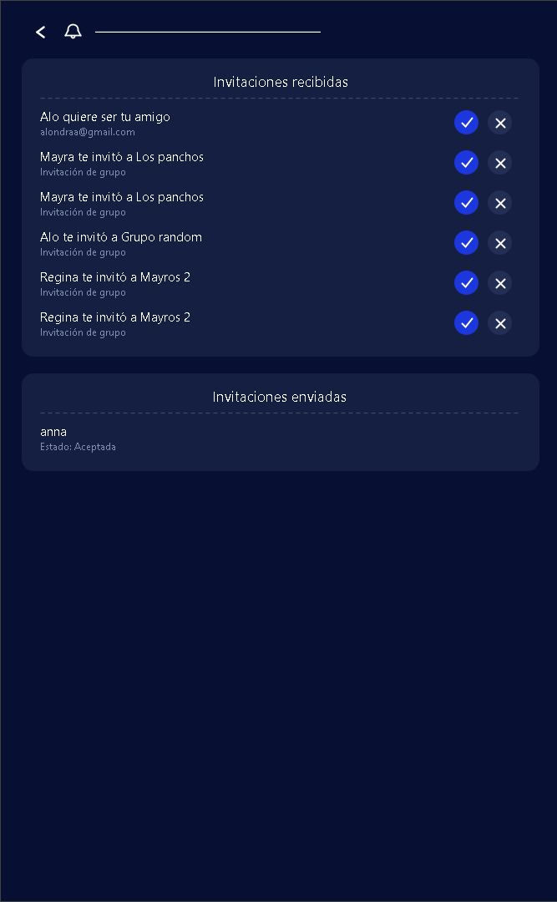
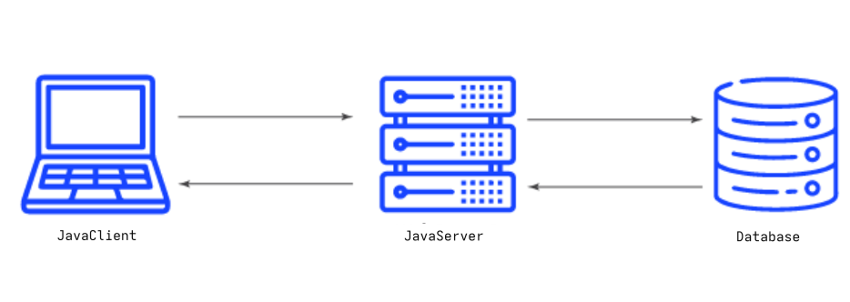
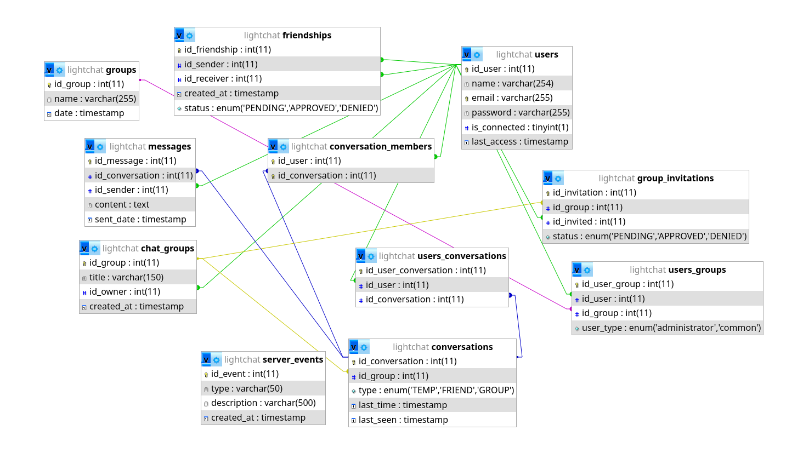
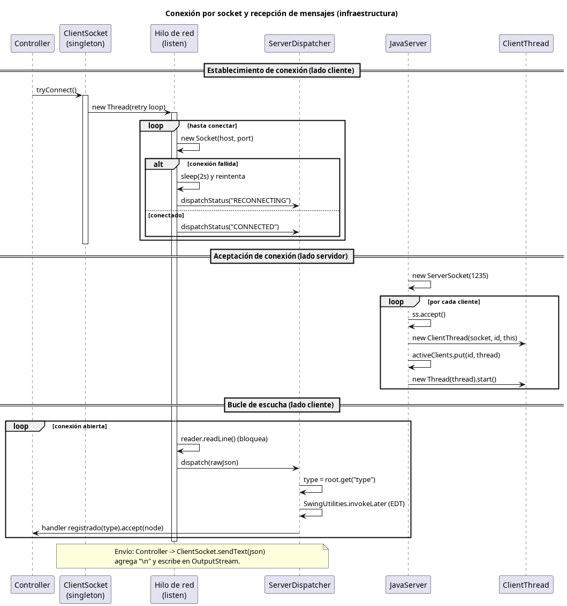

# LightChat

A Java-based client-server messaging application developed by a team of 8 students. LightChat provides real-time communication, user management, and a scalable architecture designed for educational and software engineering purposes.

## Project Summary

- Team size: 8 developers
- Development duration: 2 weeks
- Architecture: Client-Server
- Communication: TCP Sockets + JSON (Jackson)
- Database: MySQL
- UI Framework: Java Swing

## Table of Contents

- [Demo](#demo)
- [Features](#features)
- [Architecture](#architecture)
- [Tech Stack](#tech-stack)
- [Lessons Learned](#lessons-learned)
- [Future Improvements](#future-improvements)

## Demo

<table>
  <tr>
    <td></td>
    <td></td>
  </tr>
  <tr>
    <td></td>
    <td></td>
  </tr>
</table>

## Features

- Real-time one-to-one messaging
- Group chat support
- Friend request management
- User authentication and session handling
- Persistent message storage
- Socket-based communication infrastructure

## Architecture

### Overview



Clients communicate with the server through TCP sockets.
Messages are serialized using Jackson and transmitted as JSON payloads.
The server manages authentication, routing, and persistence through a MySQL database.

### Database (ERD)



### Sequence Diagram of socket connections and message reception



## Tech Stack

- Java 21
- Swing
- Jackson
- MySQL 8
- mysql-connector-j 9.7.0
- Git

## My Contribution

- Led a team of 8 developers throughout design, implementation, and integration phases.
- Designed the JSON communication protocol using Jackson serialization/deserialization.
- Developed backend business logic and server-side request handling.
- Managed Git workflows, branching strategies, and repository organization.
- Coordinated integration testing between frontend and backend teams.

## Installation

### Clone repository

```bash 
$ git clone https://github.com/Adotal/LightChat
$ cd LightChat
```

### Start local server & client from Netbeans

- ChatClient folder contains client app project
- ChatServer folder contains server app project

## Lessons Learned

- Managing a multi-developer project
- Client-server communication
- Concurrent user handling
- Git workflow coordination

## Future Improvements

- End-to-end encryption
- Voice channels
- Group chat support
- Docker deployment