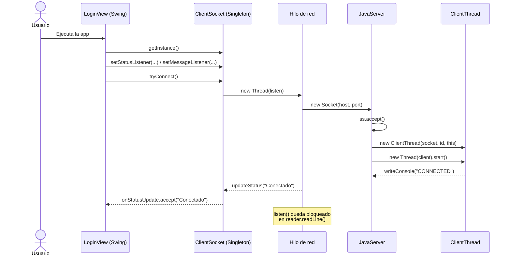
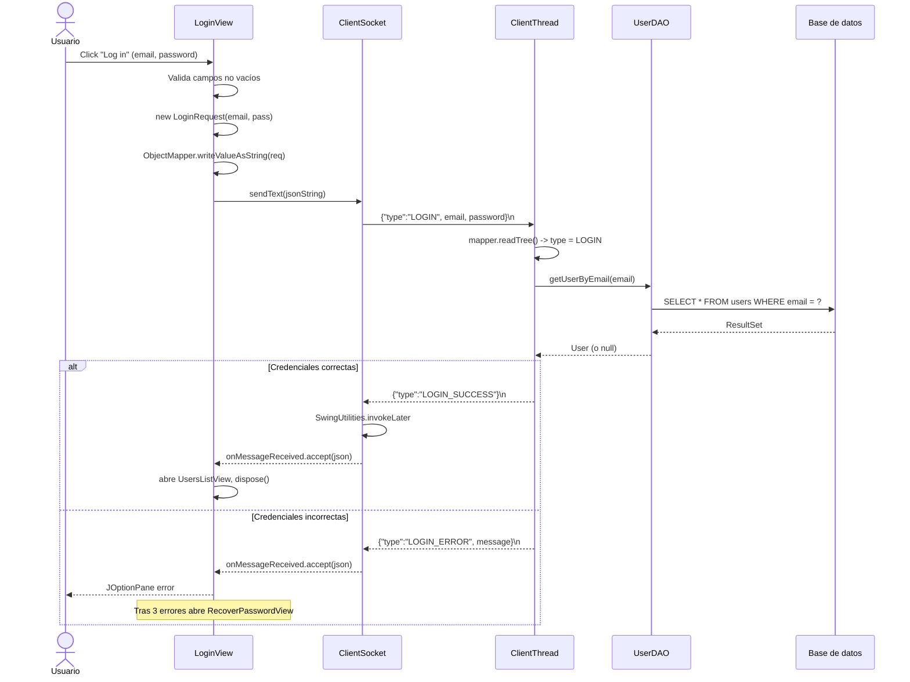
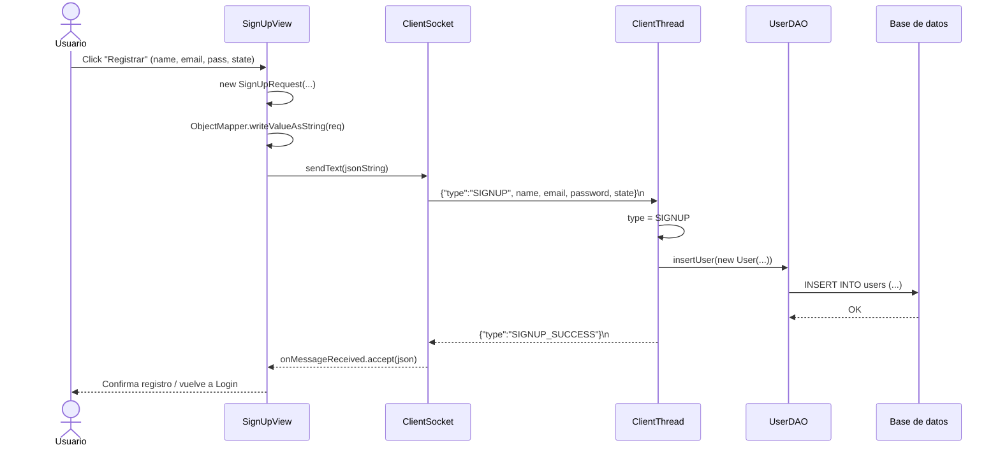
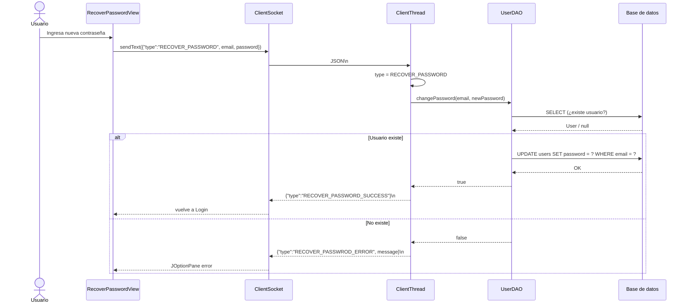
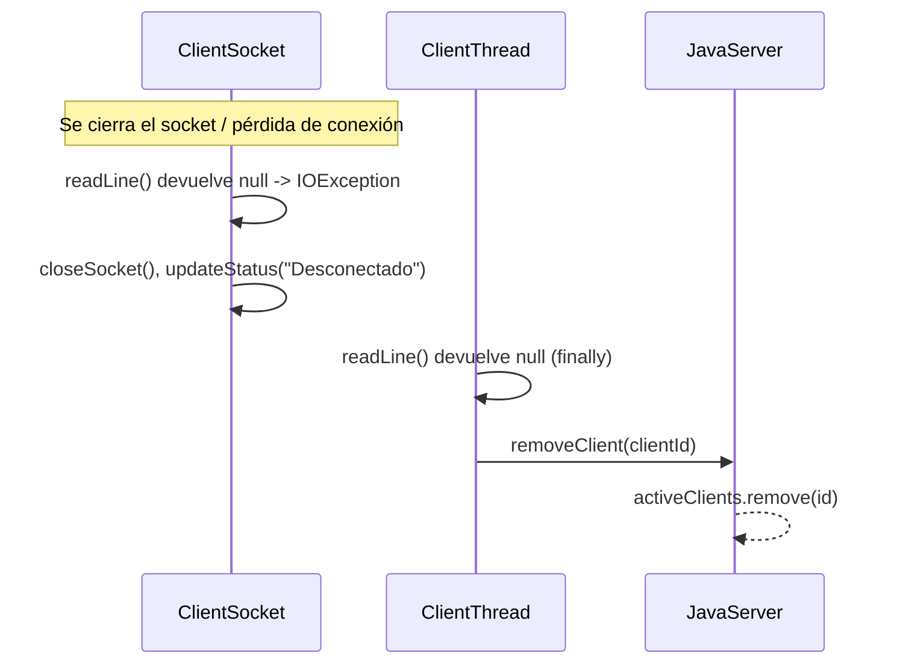

# Diagramas de Secuencia — App de Mensajería (LightChat)

Arquitectura cliente-servidor basada en sockets TCP, con intercambio de mensajes
en formato JSON (serializados/deserializados con Jackson). Cada respuesta termina
con un salto de línea (`\n`) que delimita el mensaje.

## 1. Arranque y conexión del cliente

## 2. Inicio de sesión (LOGIN)

## 3. Registro de usuario (SIGNUP)

## 4. Recuperar contraseña (RECOVER_PASSWORD)

## 5. Desconexión del cliente

